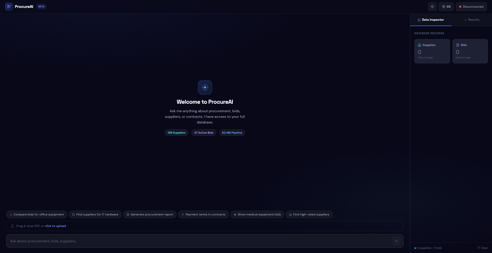
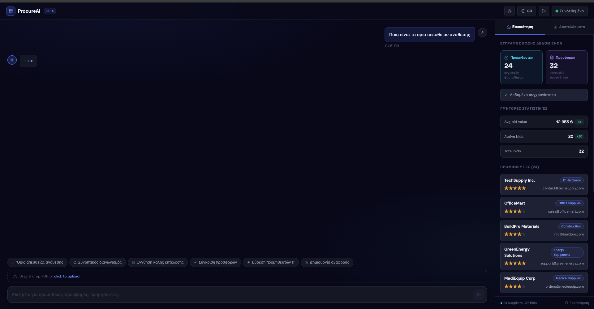
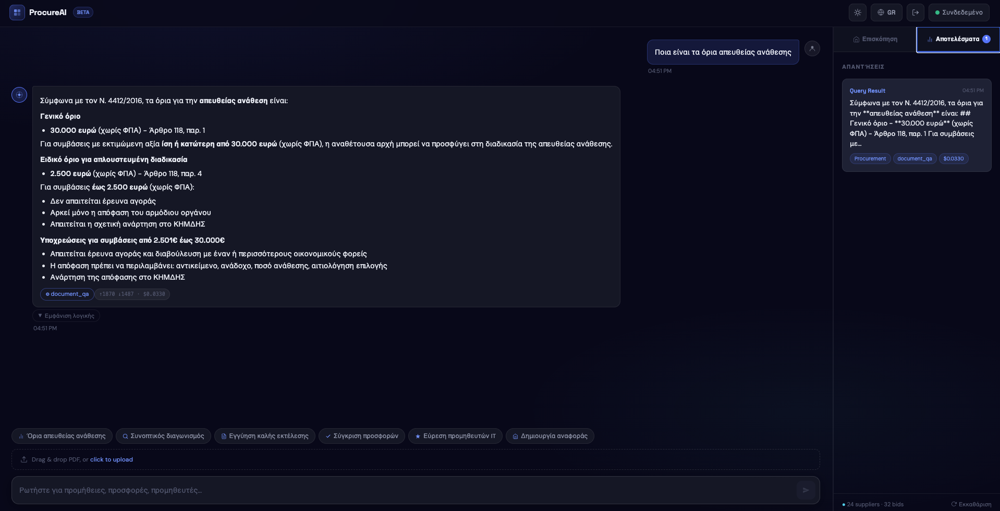
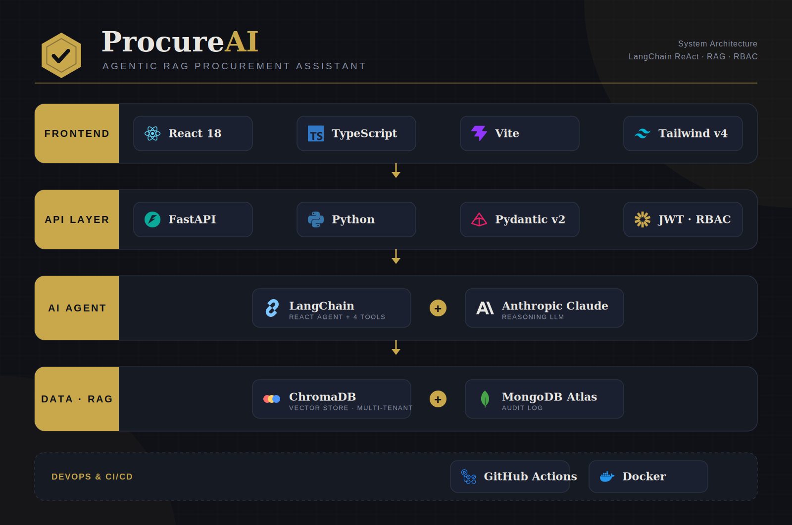
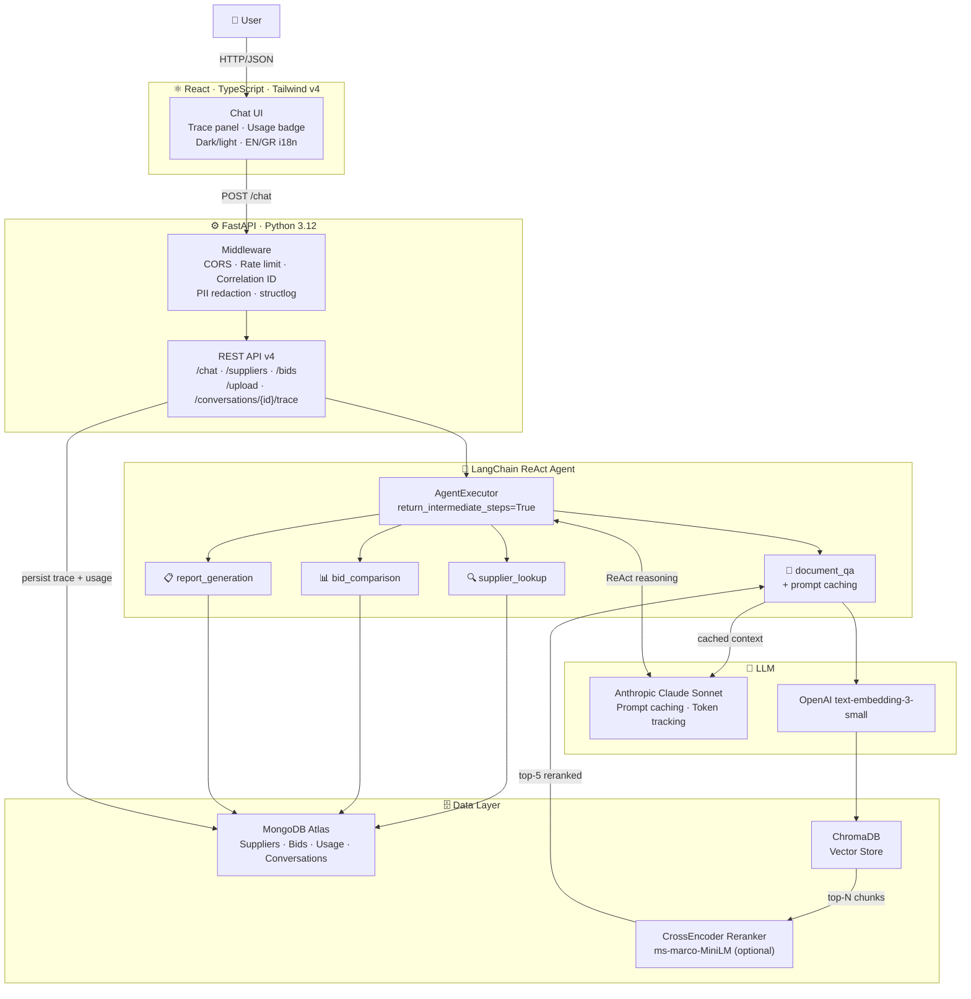

<div align="center">

<br/>
<p><em>AI-powered procurement assistant for Greek public sector organizations</em></p>
</div>

---

<div align="center">

[](https://github.com/GiorgosPanagopoulos/procureai/actions/workflows/ci.yml)


[](https://pre-commit.com)
[](docs/ProcureAI_Documentation.pdf)

</div>

---

ProcureAI is an AI-powered procurement assistant built for Greek public sector organizations. It answers natural language queries about public contracts, processes documents published on **ΚΗΜΔΗΣ** and **ΕΣΗΔΗΣ**, and applies **N.4412/2016** (Public Contracts for Works, Supplies and Services) as the authoritative legal basis for every response. The system includes production-grade RBAC (3 roles), audit logging, prompt versioning, and a procurement ontology — backed by 153 tests across all modules.

---

## 🎬 Demo

<div align="center">


</div>

---

## 📄 Documentation

Full technical documentation (architecture, sequence, deployment, RAG & auth flow diagrams, API reference, bibliography) is available as a PDF:

**[📘 ProcureAI_Documentation.pdf](docs/ProcureAI_Documentation.pdf)**

---

## ✨ Features

| Feature | Description |
|---------|-------------|
| 🔍 **Supplier Lookup** | Natural language queries against the supplier database |
| 📊 **Bid Comparison** | Ranked bid analysis with pricing, delivery terms, and compliance scoring |
| 📄 **Document Q&A** | RAG-powered Q&A over uploaded procurement contracts and PDFs |
| 📋 **Report Generation** | Automated procurement summary reports |
| ⚖️ **Greek Procurement Law** | N.4412/2016 knowledge base via RAG — article-level citations in every answer |
| 🌐 **Bilingual UI** | Greek/English toggle with automatic locale switching |
| 🌗 **Dark/Light Mode** | Full theme support via Tailwind CSS v4 |
| 🔐 **RBAC** | Role-based access control: Admin / Procurement Officer / Viewer, JWT-embedded, enforced via FastAPI Depends() |
| 🏢 **Multi-tenancy** | ChromaDB per-user document isolation via where={user_id} metadata filter + ContextVar threading |
| 🗒️ **Audit Log** | Every query logged to MongoDB (user, query, AI response summary, sources, timestamp) — exposed at /admin/audit-logs |
| 📝 **Prompt Versioning** | File-based versioned prompts per use case under /prompts/use_case/v1.txt, loaded via PromptLoader singleton |
| 🧩 **Procurement Ontology** | 10 Pydantic v2 domain models: Tender, Supplier, Contract, ProcurementRequest, EvaluationCriteria, BudgetAllocation, ApprovalStage, ComplianceCheck, RiskAssessment |

---

## 💬 Example

> **Ερώτηση:** Ποια είναι τα όρια απευθείας ανάθεσης;

> **ProcureAI:** Σύμφωνα με το **Άρθρο 118 του Ν.4412/2016**, η απευθείας ανάθεση επιτρέπεται για προμήθειες και υπηρεσίες εκτιμώμενης αξίας **έως 30.000 € (χωρίς ΦΠΑ)**. Για έργα, το αντίστοιχο όριο ορίζεται στις **20.000 €**. Σε κάθε περίπτωση, η ανάθεση πρέπει να τεκμηριώνεται και να καταχωρείται στο ΚΗΜΔΗΣ εντός των προβλεπόμενων προθεσμιών.

---

## 📸 Screenshots

| Welcome State |
|:---:|
|  |

| Typing Indicator |
|:---:|
|  |

| Agent Response |
|:---:|
|  |

---

## 🏗️ Architecture

<div align="center">

</div>



### One-command Docker start

```bash
cp backend/.env.example backend/.env   # add your API keys
docker compose up --build
# frontend → http://localhost:3000
# backend  → http://localhost:8000
```

---

## 🛠️ Tech Stack

| Technology | Role |
|-----------|------|
|  | Backend runtime, async FastAPI server, agent logic |
|  | REST API framework with async Motor driver |
|  | Chat interface, upload panel, results dashboard |
|  | Type-safe frontend development |
|  | UI styling, dark/light mode, responsive layout |
|  | `AgentExecutor` + `create_react_agent` + `@tool` decorator |
|  | `ChatAnthropic` (`claude-sonnet-4-6`) for LLM reasoning |
|  | `text-embedding-3-small` for ChromaDB vector search |
|  | Atlas cloud store for supplier and bid records |
|  | Local vector store for RAG document retrieval |

---


## 🚀 Quick Start

### 1. Clone the repository

```bash
git clone https://github.com/GiorgosPanagopoulos/procureai.git
cd procureai
```

### 2. Backend setup

```bash
cp backend/.env.example backend/.env   # then fill in your API keys
python backend/data/seed.py            # seed MongoDB with sample data
```

Start the backend server:

```bash
# Create and activate virtual environment (from project root)
python3.12 -m venv .venv
source .venv/bin/activate

# Install dependencies
pip install -r backend/requirements.txt

# Start the backend
cd backend
PYTHONPATH=./ uvicorn main:app --reload --host 0.0.0.0 --port 8000
```

### 3. Frontend setup

```bash
cd frontend
npm install
npm run dev
```

Frontend available at `http://localhost:3000` (pinned via `strictPort` in vite.config.ts).

### 4. One-shot start

From the repo root, run both services with:

```bash
./start.sh
```

---

## 🔑 Environment Variables

Copy `backend/.env.example` to `backend/.env` and fill in the values below:

| Variable | Description | Required | Default |
|----------|-------------|----------|---------|
| `ANTHROPIC_API_KEY` | Claude API key for LLM reasoning | ✅ | — |
| `OPENAI_API_KEY` | OpenAI API key for document embeddings | ✅ | — |
| `MONGODB_URI` | MongoDB Atlas connection string | ✅ | `mongodb://localhost:27017` |
| `ALLOWED_ORIGINS` | Comma-separated CORS origins | ➖ | `http://localhost:3000,http://localhost:5173` |
| `CHROMA_PATH` | Path to ChromaDB persistence directory | ➖ | `./chroma_db` |
| `USE_RERANKER` | Enable CrossEncoder reranker for RAG | ➖ | `false` |

### LangSmith

| Variable | Description | Required | Default |
|----------|-------------|----------|---------|
| `LANGCHAIN_TRACING_V2` | Enable LangSmith tracing | ➖ | `false` |
| `LANGCHAIN_API_KEY` | LangSmith API key | ➖ | — |
| `LANGCHAIN_PROJECT` | LangSmith project name | ➖ | `procureai` |

---

## 📡 API Endpoints

| Method | Endpoint | Rate limit | Description |
| ------ | -------- | ---------- | ----------- |
| `GET` | `/` | — | Health check |
| `GET` | `/suppliers` | 30/min | Return all supplier records |
| `GET` | `/bids` | 30/min | Return all bid records |
| `POST` | `/chat` | 10/min | Send `{"message":"…"}` to ReAct agent; returns `response`, `trace`, `usage`, `conversation_id` |
| `POST` | `/upload` | 30/min | Upload a PDF document (multipart form) |
| `GET` | `/conversations/{id}/trace` | — | Get ReAct reasoning trace for a conversation |
| `POST` | `/doc_qa` | 30/min | Ask a question directly (`?question=…`) |
| `POST` | `/auth/register` | 10/min | Register user with role assignment |
| `POST` | `/auth/login` | 10/min | Returns JWT token with embedded role |
| `GET` | `/admin/audit-logs` | 10/min | Paginated audit log (Admin only) |

---

## 📁 Project Structure

```text
procureai/
├── backend/
│   ├── main.py                 # App factory — lifespan, middleware, router wiring (89 LOC)
│   ├── db.py                   # MongoDB Atlas client + database instance
│   ├── config.py               # Pydantic Settings (.env)
│   ├── exceptions.py           # Custom HTTP exceptions
│   ├── middleware/
│   │   ├── cors.py             # CORS setup
│   │   ├── correlation.py      # X-Correlation-ID middleware
│   │   └── rate_limit.py       # SlowAPI rate limiter
│   ├── llm/
│   │   ├── pricing.py          # Model constants, token cost calculator, usage accumulator
│   │   ├── callbacks.py        # LangChain usage callback handler
│   │   └── clients.py          # Anthropic + OpenAI client instances
│   ├── rag/
│   │   ├── vectorstore.py      # ChromaDB client + collection
│   │   ├── embeddings.py       # OpenAI text-embedding-3-small
│   │   ├── chunking.py         # Text splitting logic
│   │   ├── ingest.py           # PDF extraction + document ingestion pipeline
│   │   └── reranker.py         # CrossEncoder reranker (lazy-loaded)
│   ├── agent/
│   │   ├── prompt.py           # System prompt + ReAct template
│   │   ├── tools.py            # @tool: document_qa, bid_comparison, supplier_lookup, report_generation
│   │   └── executor.py         # AgentExecutor, trace builder, run_agent()
│   ├── routers/
│   │   ├── health.py           # GET /
│   │   ├── chat.py             # /chat, /upload, /doc_qa, /conversations/{id}/trace
│   │   ├── suppliers.py        # /suppliers, /bids
│   │   └── reports.py          # /reports
│   ├── schemas/                # Pydantic request/response models
│   ├── models/                 # 10 procurement domain entities (Pydantic v2 ontology)
│   ├── auth/                   # JWT auth, role enforcement, RBAC Depends() decorators
│   ├── audit/                  # Fire-and-forget audit log writer + MongoDB collection
│   ├── prompts/                # Versioned prompt files — /use_case/v1.txt, PromptLoader singleton
│   ├── security/               # PII redaction
│   ├── core/                   # Sentry init
│   ├── crud/                   # DB operations
│   ├── api/routes/             # Auth router
│   ├── data/
│   │   ├── pdfs/               # Sample procurement contracts & N.4412/2016 excerpts
│   │   └── seed.py             # MongoDB seed script
│   ├── requirements.txt
│   └── .env.example
├── frontend/
│   ├── src/
│   │   ├── App.tsx
│   │   └── main.tsx
│   ├── package.json
│   └── vite.config.ts
├── docs/screenshots/
├── start.sh
└── README.md
```

---

## 💡 Why ProcureAI?

ProcureAI was built as the final project for the **AUEB "AI for Developers" programme** (KEDIVIM / OPA, 2026). The goal was to apply production-grade AI engineering patterns to a real-world domain — Greek public sector procurement under **Ν.4412/2016**.

Key technical decisions:

| Decision | Rationale |
|----------|-----------|
| **ReAct agent over fixed chains** | Dynamic tool selection lets the agent handle diverse, multi-step queries without hardcoded routing logic |
| **Hybrid data layer** | MongoDB for structured supplier/bid records (fast filtering, aggregation); ChromaDB for document embeddings (semantic similarity) |
| **Decoupled embedding & LLM providers** | OpenAI embeddings + Anthropic Claude — avoids vendor lock-in, allows independent cost optimisation of each layer |
| **N.4412/2016 RAG knowledge base** | Ingested full law text enables article-level citations for ΚΗΜΔΗΣ/ΕΣΗΔΗΣ queries and direct-award threshold questions |
| **Bilingual design (Greek/English)** | Built for real-world institutional deployment in Greek public-sector procurement contexts |
| **RBAC via JWT claims** | Role embedded at token issue time — no extra DB lookup per request, enforced declaratively via Depends() |
| **ChromaDB multi-tenancy** | ContextVar-based user isolation ensures zero cross-user data leakage without a separate collection per user |
| **Fire-and-forget audit log** | asyncio.create_task() writes to MongoDB without blocking the request path — zero latency cost |
| **File-based prompt versioning** | Prompts are code artifacts, not DB rows — version-controlled, diff-able, rollback via git |

---

## 🔭 Roadmap

### ✅ Phase 2 — Domain Intelligence (Complete · 153 tests)
- Procurement ontology — 10 Pydantic v2 models covering the full procurement lifecycle
- RBAC — Admin / Procurement Officer / Viewer roles, JWT-embedded, enforced via FastAPI Depends()
- ChromaDB multi-tenancy — per-user document isolation via where={user_id} + ContextVar threading
- Audit log — MongoDB collection, fire-and-forget async writes, /admin/audit-logs endpoint
- Prompt versioning — file-based /prompts/use_case/v1.txt system, PromptLoader singleton
- Security: admin self-assignment gap closed on /register — UserCreate schema enforces Literal["viewer"], HTTP 422 on violation, admin seeding via lifespan only

### 🔜 Phase 3 — Enterprise Workflows
- Tool-calling agent: AgentExecutor with dedicated tools for CPV code lookup, legal validation (Ν.4412/2016), supplier lookup, risk scoring, contract summarization, tender generation
- Approval chain engine with state machine: ProcurementRequest → Manager → Legal → Finance → Final Approval

### 🔜 Phase 4 — Governance & Observability
- LLM evaluation framework with golden test set based on Ν.4412/2016 (groundedness, hallucination rate, compliance accuracy)
- Async processing pipeline: Redis queues + OCR for PDF ingestion, embeddings generation, and vendor scoring

### 🔜 Phase 5 — Pre-Award Legal Audit Module 🛡️
- Deterministic legal-validation endpoint (`POST /api/tenders/audit`) που δέχεται προσχέδιο διακήρυξης και επιστρέφει structured risk report
- Ξεχωριστό ChromaDB collection: Ν.4412/2016 (άρθρα) + νομολογία ΕΑΔΗΣΥ (Ενιαία Αρχή Δημόσιων Συμβάσεων)
- Gap analysis: νομικοί κίνδυνοι, ελλείπουσες υποχρεωτικές ρήτρες, τεχνικά κενά (ISO/EN), αναιτιολόγητοι αποκλεισμοί
- Structured output με υποχρεωτικά citations ανά risk (`article_ref` + source decision)
- Business value: μείωση lead time ανάθεσης, αποτροπή προδικαστικών προσφυγών (ΕΑΔΗΣΥ) και δικαστικών εξόδων (ΣτΕ)
- Decision-support only — mandatory human-in-the-loop

---

## 📄 License

This project is licensed under the [MIT License](LICENSE).

---
<div align="center">
<strong>⚡ Built by <a href="https://github.com/GiorgosPanagopoulos">Georgios Panagopoulos</a></strong><br/>
<em>"I build things I'd trust with something that matters."</em>
<br/><br/>
<a href="https://github.com/GiorgosPanagopoulos"></a>
<a href="https://linkedin.com/in/georgios-panagopoulos-9253842ba"></a>
<br/><br/>
☕ Powered by mass amounts of caffeine & mass amounts of curiosity
</div>
