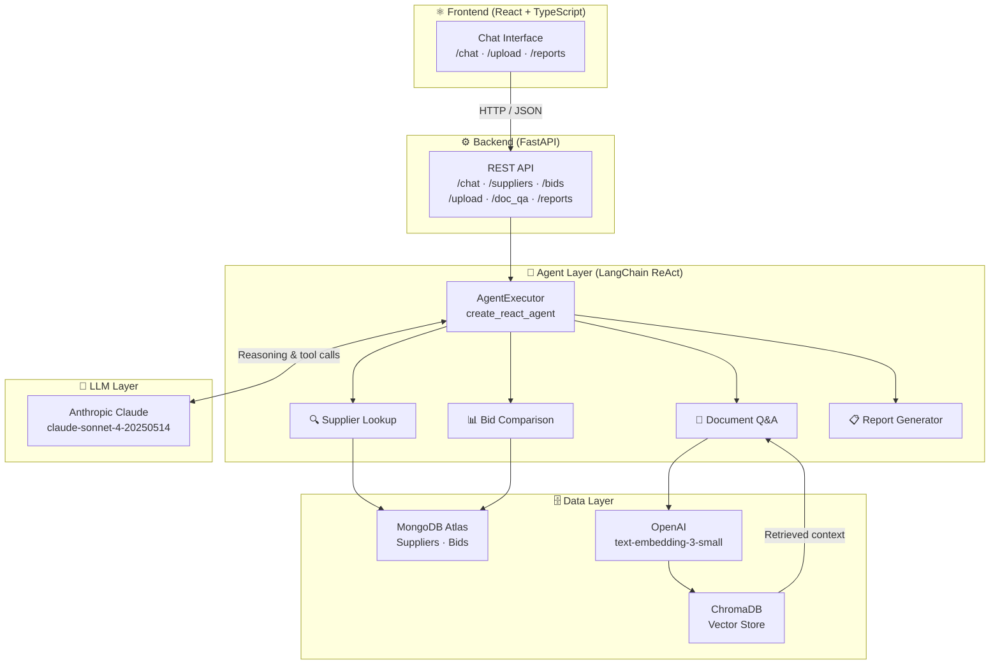
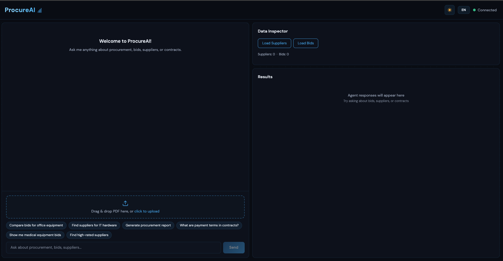
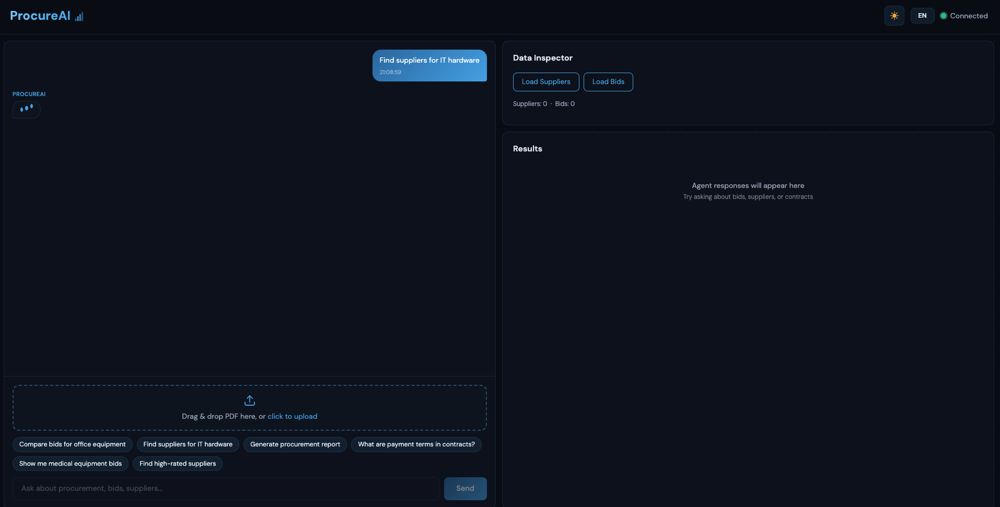
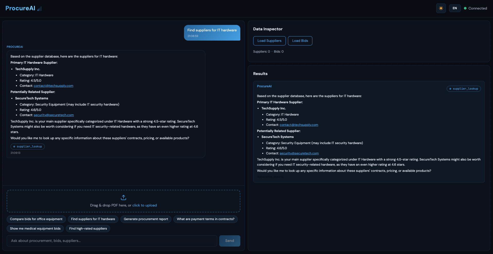

<div align="center">
<h1>🤖 ProcureAI</h1>
<p><strong>AI-Native Procurement Assistant powered by LangChain ReAct Agent & RAG</strong></p>
<p><em>Turn procurement workflows into natural language actions</em></p>
</div>

---

<div align="center">


</div>

---

## 🎬 Demo

<div align="center">


</div>

---

## ✨ Features

| Feature | Description |
|---------|-------------|
| 🔍 **Supplier Lookup** | Natural language queries against the supplier database |
| 📊 **Bid Comparison** | Ranked bid analysis with pricing, delivery terms, and compliance scoring |
| 📄 **Document Q&A** | RAG-powered Q&A over uploaded procurement contracts and PDFs |
| 📋 **Report Generation** | Automated procurement summary reports |
| 🌐 **Bilingual UI** | Greek/English toggle with automatic locale switching |
| 🌗 **Dark/Light Mode** | Full theme support via Tailwind CSS v4 |

---

## 🏗️ Architecture



---

## 🛠️ Tech Stack

| Technology | Role |
|-----------|------|
|  | Backend runtime, async FastAPI server, agent logic |
|  | REST API framework with async Motor driver |
|  | Chat interface, upload panel, results dashboard |
|  | Type-safe frontend development |
|  | UI styling, dark/light mode, responsive layout |
|  | `AgentExecutor` + `create_react_agent` + `@tool` decorator |
|  | `ChatAnthropic` (`claude-sonnet-4-20250514`) for LLM reasoning |
|  | `text-embedding-3-small` for ChromaDB vector search |
|  | Atlas cloud store for supplier and bid records |
|  | Local vector store for RAG document retrieval |

---

## 📸 Screenshots

### 🖥️ Welcome State

Split-panel UI with drag-and-drop PDF upload, suggestion chips, and animated signal icon.



### ⏳ Typing Indicator

Real-time animated typing indicator while the ReAct agent processes the query.



### 🔍 Agent Response

Markdown-rendered response with tool usage badge and mirrored results panel.



---

## 🚀 Quick Start

### 1. Clone the repository

```bash
git clone https://github.com/GiorgosPanagopoulos/procureai.git
cd procureai
```

### 2. Backend setup

```bash
cp backend/.env.example backend/.env   # then fill in your API keys
python backend/data/seed.py            # seed MongoDB with sample data
```

Start the backend server:

```bash
# Create and activate virtual environment (from project root)
python3.12 -m venv .venv
source .venv/bin/activate

# Install dependencies
pip install -r backend/requirements.txt

# Start the backend
cd backend
PYTHONPATH=./ uvicorn main:app --reload --host 0.0.0.0 --port 8000
```

### 3. Frontend setup

```bash
cd frontend
npm install
npm run dev
```

Frontend available at `http://localhost:5173` (Vite default).

### 4. One-shot start

From the repo root, run both services with:

```bash
./start.sh
```

---

## 🔑 Environment Variables

Copy `backend/.env.example` to `backend/.env` and fill in the values below:

| Variable | Description | Required |
|----------|-------------|:--------:|
| `ANTHROPIC_API_KEY` | Claude API key for LLM reasoning | ✅ |
| `OPENAI_API_KEY` | OpenAI API key for document embeddings | ✅ |
| `MONGODB_URI` | MongoDB Atlas connection string | ✅ |

---

## 📡 API Endpoints

| Method | Endpoint | Description |
|--------|----------|-------------|
| `GET` | `/` | Health check |
| `GET` | `/suppliers` | Return all supplier records |
| `GET` | `/bids` | Return all bid records |
| `POST` | `/chat` | Send a message `{"message": "..."}` to the ReAct agent |
| `POST` | `/upload` | Upload a PDF document (multipart form) |
| `GET` | `/reports` | Retrieve procurement report data |
| `POST` | `/doc_qa` | Ask a question about an uploaded document (`?question=...`) |

---

## 📁 Project Structure

```text
procureai/
├── backend/
│   ├── data/
│   │   ├── pdfs/               # Sample procurement contracts
│   │   └── seed.py             # MongoDB seed script
│   ├── models/
│   │   ├── supplier.py         # Pydantic Supplier schema
│   │   └── bid.py              # Pydantic Bid schema
│   ├── main.py                 # FastAPI app + LangChain agent + all tools
│   ├── requirements.txt
│   └── .env.example
├── frontend/
│   ├── src/
│   │   ├── App.tsx             # Main React component
│   │   └── main.tsx
│   ├── package.json
│   └── vite.config.ts
├── docs/
│   └── screenshots/
│       ├── demo.gif
│       ├── supplier-lookup.png
│       ├── bid-comparison.png
│       └── document-qa.png
├── start.sh                    # One-shot startup script
└── README.md
```

---

## 💡 Why ProcureAI?

ProcureAI was built as the final project for the **AUEB "AI for Developers" programme** (KEDIVIM / OPA, 2026). The goal was to apply production-grade AI engineering patterns to a real-world domain — institutional procurement.

Key technical decisions:

| Decision | Rationale |
|----------|-----------|
| **ReAct agent over fixed chains** | Dynamic tool selection lets the agent handle diverse, multi-step queries without hardcoded routing logic |
| **Hybrid data layer** | MongoDB for structured supplier/bid records (fast filtering, aggregation); ChromaDB for document embeddings (semantic similarity) |
| **Decoupled embedding & LLM providers** | OpenAI embeddings + Anthropic Claude — avoids vendor lock-in, allows independent cost optimisation of each layer |
| **Bilingual design (Greek/English)** | Built for real-world institutional deployment in Greek public-sector or academic procurement contexts |

---

## 📄 License

This project is licensed under the [MIT License](LICENSE).

---
<div align="center">
<strong>⚡ Built by <a href="https://github.com/GiorgosPanagopoulos">Georgios Panagopoulos</a></strong><br/>
<em>"I build things I'd trust with something that matters."</em>
<br/><br/>
<a href="https://github.com/GiorgosPanagopoulos"></a>
<a href="https://linkedin.com/in/georgios-panagopoulos-9253842ba"></a>
<br/><br/>
☕ Powered by mass amounts of caffeine & mass amounts of curiosity
</div>
