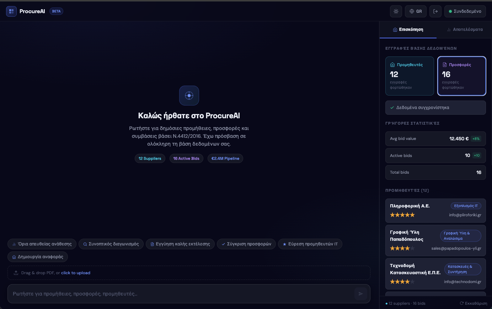
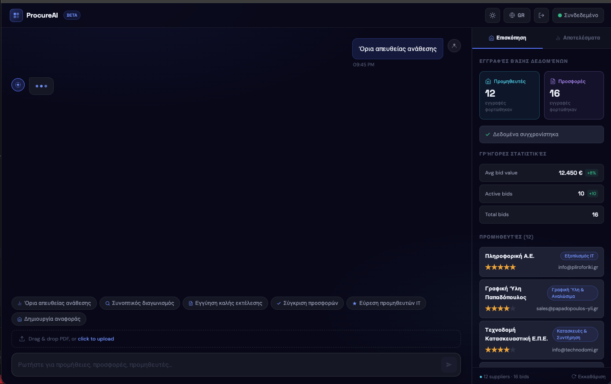
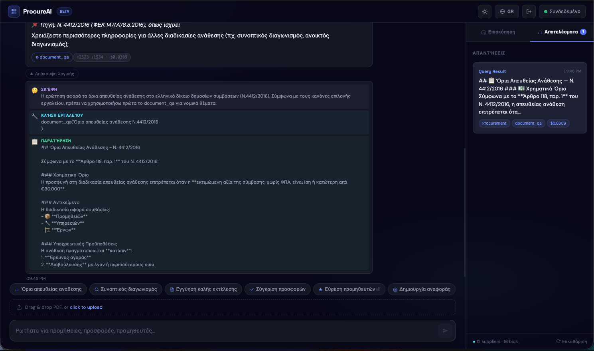
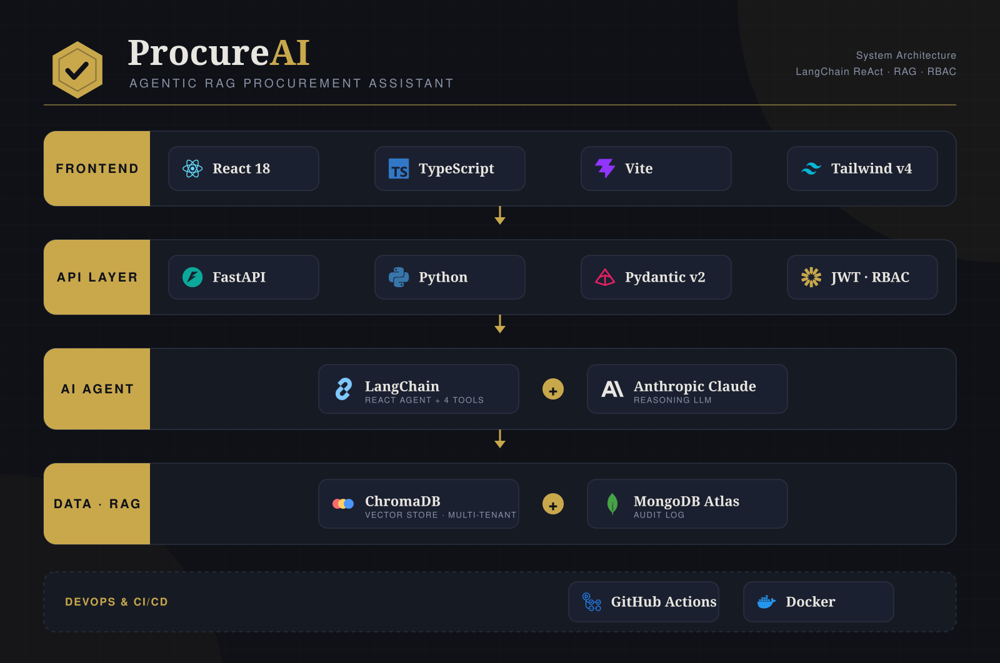
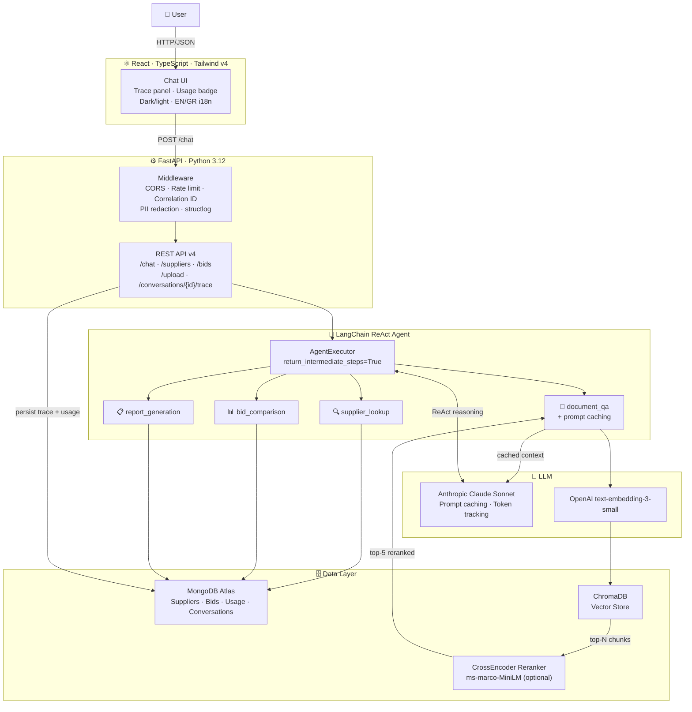

<div align="center">

<br/>
<p><em>AI-powered procurement assistant for Greek public sector organizations</em></p>
</div>

---

<div align="center">

[](https://github.com/GiorgosPanagopoulos/procureai/actions/workflows/ci.yml)


[](https://pre-commit.com)
[](docs/ProcureAI_Documentation.pdf)

</div>

---

ProcureAI is an AI-powered procurement assistant built for Greek public sector organizations. It answers natural language queries about public contracts, processes documents published on **ΚΗΜΔΗΣ** and **ΕΣΗΔΗΣ**, and applies **N.4412/2016** (Public Contracts for Works, Supplies and Services) as the authoritative legal basis for every response. The system includes production-grade RBAC (3 roles), audit logging, and prompt versioning — backed by 168 tests across all modules.

---

## 🎬 Demo

<div align="center">


</div>

---

## 📄 Documentation

Full technical documentation (architecture, sequence, deployment, RAG & auth flow diagrams, API reference, bibliography) is available as a PDF:

**[📘 ProcureAI_Documentation.pdf](docs/ProcureAI_Documentation.pdf)**

---

## ✨ Features

| Feature | Description |
|---------|-------------|
| 🔍 **Supplier Lookup** | Natural language queries against the supplier database |
| 📊 **Bid Comparison** | Ranked bid analysis with pricing, delivery terms, and compliance scoring |
| 📄 **Document Q&A** | RAG-powered Q&A over uploaded procurement contracts and PDFs |
| 📋 **Report Generation** | Automated procurement summary reports |
| ⚖️ **Greek Procurement Law** | N.4412/2016 knowledge base via RAG — article-level citations in every answer |
| 🌐 **Bilingual UI** | Greek/English toggle with automatic locale switching |
| 🌗 **Dark/Light Mode** | Full theme support via Tailwind CSS v4 |
| 🔐 **RBAC** | Role-based access control: Admin / Procurement Officer / Viewer, JWT-embedded, enforced via FastAPI Depends() |
| 🏢 **Multi-tenancy** | ChromaDB per-user document isolation via where={user_id} metadata filter + ContextVar threading |
| 🗒️ **Audit Log** | Every query logged to MongoDB (user, query, AI response summary, sources, timestamp) — exposed at /admin/audit-logs |
| 📝 **Prompt Versioning** | File-based versioned prompts per use case under /prompts/use_case/v1.txt, loaded via PromptLoader singleton |
| 🧩 **Structured Outputs** | Claude returns bid rankings as a validated Pydantic v2 model, so the ReAct agent observes stable JSON instead of prose |

---

## 💬 Example

> **Ερώτηση:** Ποια είναι τα όρια απευθείας ανάθεσης;

> **ProcureAI:** Σύμφωνα με το **Άρθρο 118 του Ν.4412/2016**, η απευθείας ανάθεση επιτρέπεται για προμήθειες και υπηρεσίες εκτιμώμενης αξίας **έως 30.000 € (χωρίς ΦΠΑ)**. Για έργα, το αντίστοιχο όριο ορίζεται στις **20.000 €**. Σε κάθε περίπτωση, η ανάθεση πρέπει να τεκμηριώνεται και να καταχωρείται στο ΚΗΜΔΗΣ εντός των προβλεπόμενων προθεσμιών.

---

## 📸 Screenshots

| Welcome State |
|:---:|
|  |

| Typing Indicator |
|:---:|
|  |

| Agent Response |
|:---:|
|  |

---

## 🏗️ Architecture

<div align="center">

</div>


```mermaid
graph TD
    User["👤 User"] -->|HTTP/JSON| React

    subgraph Frontend["⚛️ React · TypeScript · Tailwind v4"]
        React["Chat UI\nTrace panel · Usage badge\nDark/light · EN/GR i18n"]
    end

    subgraph Backend["⚙️ FastAPI · Python 3.12"]
        MW["Middleware\nCORS · Rate limit · Correlation ID\nPII redaction · structlog"]
        API["REST API v4\n/chat · /suppliers · /bids\n/upload · /conversations/{id}/trace"]
    end

    subgraph Agent["🦜 LangChain ReAct Agent"]
        EXEC["AgentExecutor\nreturn_intermediate_steps=True"]
        T1["🔍 supplier_lookup"]
        T2["📊 bid_comparison"]
        T3["📄 document_qa\n+ prompt caching"]
        T4["📋 report_generation"]
    end

    subgraph Data["🗄️ Data Layer"]
        MONGO["MongoDB Atlas\nSuppliers · Bids · Usage · Conversations"]
        CHROMA["ChromaDB\nVector Store"]
        RERANK["CrossEncoder Reranker\nms-marco-MiniLM (optional)"]
    end

    subgraph LLM["🧠 LLM"]
        CLAUDE["Anthropic Claude Sonnet\nPrompt caching · Token tracking"]
        EMBED["OpenAI text-embedding-3-small"]
    end

    React -->|POST /chat| MW
    MW --> API
    API --> EXEC
    EXEC --> T1 & T2 & T4
    EXEC --> T3
    T1 & T2 & T4 --> MONGO
    T3 --> EMBED --> CHROMA
    CHROMA -->|top-N chunks| RERANK -->|top-5 reranked| T3
    T3 -->|cached context| CLAUDE
    EXEC <-->|ReAct reasoning| CLAUDE
    API -->|persist trace + usage| MONGO
```

---

## 🧠 GenAI Logic

### ReAct agent loop

`POST /chat` runs through a LangChain `AgentExecutor` built on `create_react_agent` with
`return_intermediate_steps=True` and `max_iterations=5`. On each turn the agent (`ChatAnthropic`,
Claude Sonnet) reasons in a Thought → Action → Observation loop: it decides whether to call a
tool, inspects the tool's output, and either calls another tool or produces a final answer. The
full loop — not just the final answer — is captured: `_build_trace()` in
[`agent/executor.py`](backend/agent/executor.py) walks `intermediate_steps` and extracts each
`Thought`, `tool_call` (tool name + input), and `observation` into a structured trace, persisted
per-conversation in MongoDB and exposed via `GET /conversations/{id}/trace`. The frontend's
trace panel renders this so a reviewer can see *why* the agent picked a given tool, not just what
it said.

### The four tools

The agent chooses among four `@tool`-decorated functions in
[`agent/tools.py`](backend/agent/tools.py) based on their docstrings (which double as the
tool-selection prompt):

| Tool | Selected when | Backing store |
|------|----------------|---------------|
| `document_qa` | The query concerns prices, budgets, contract terms, or content inside an uploaded PDF — the tool's docstring tells the agent to prefer it first for anything price- or document-related | ChromaDB (RAG) + Claude |
| `bid_comparison` | The user wants bids ranked by price and delivery time | MongoDB (`bids`) |
| `supplier_lookup` | The user wants suppliers filtered by category or minimum rating | MongoDB (`suppliers`) |
| `report_generation` | The user wants a summary report (supplier/bid aggregates) | MongoDB (`suppliers`, `bids`) |

### RAG pipeline

`document_qa` runs: **chunk** (`rag/chunking.py` splits ingested PDF text into ~500-char,
paragraph-aware chunks) → **embed** (OpenAI `text-embedding-3-small`, `rag/embeddings.py`) →
**store/query** (ChromaDB, per-user isolated via a `user_id` metadata filter) → **optional
rerank** (`rag/reranker.py`, a lazy-loaded CrossEncoder `ms-marco-MiniLM-L-6-v2`) → **top-5 into
context**. Retrieval count depends on whether the reranker is on: with `USE_RERANKER=true`,
ChromaDB retrieves the top 20 chunks and the CrossEncoder reranks them down to the top 5; with
reranking off, ChromaDB retrieves only the top 4 directly, since there's no second-stage ranking
to narrow a wider candidate set. The resulting chunks are joined into a context block and passed
to Claude alongside the question.

### Prompt caching

The `document_qa` call to Claude marks both the system prompt and the retrieved context block
with `cache_control: {"type": "ephemeral"}` (Anthropic prompt caching). Since the system prompt
and, often, the context are stable across repeated queries in a session, this cuts redundant
input-token cost and latency on cache hits — tracked per-request via the usage accumulator in
`llm/pricing.py`.

### File-based prompt versioning

Prompts live as plain text files under `backend/prompts/<use_case>/<version>.txt` (e.g.
`prompts/chat/v1.txt`, `prompts/doc_qa/v1.txt`), each with a small metadata header (`# created:`,
`# description:`) parsed by `PromptLoader` (`core/prompt_loader.py`). The loader caches all
prompts in memory at startup and exposes `get(use_case, version)`; prompts are version-controlled
and diff-able like code, with no DB round-trip to fetch them. `GET /admin/prompts` (Admin-only)
lists all loaded versions and their metadata for inspection, and
`GET /admin/prompts/{use_case}/{version}` (Admin-only) fetches a single version's full text and
metadata.

---

## 🛠️ Tech Stack

| Technology | Role |
|-----------|------|
|  | Backend runtime, async FastAPI server, agent logic |
|  | REST API framework with async Motor driver |
|  | Chat interface, upload panel, results dashboard |
|  | Type-safe frontend development |
|  | UI styling, dark/light mode, responsive layout |
|  | `AgentExecutor` + `create_react_agent` + `@tool` decorator |
|  | `ChatAnthropic` (`claude-sonnet-4-6`) for LLM reasoning |
|  | `text-embedding-3-small` for ChromaDB vector search |
|  | Atlas cloud store for supplier and bid records |
|  | Local vector store for RAG document retrieval |

---


## 🚀 Quick Start

### 1. Clone the repository

```bash
git clone https://github.com/GiorgosPanagopoulos/procureai.git
cd procureai
```

### 2. Configure environment

```bash
cp backend/.env.example backend/.env   # then fill in your API keys
```

### 3. Run it

**Option A — Docker (fastest path):**

```bash
docker compose up --build
# frontend → http://localhost:3000
# backend  → http://localhost:8000
```

> **Editing backend code or prompts?** There's no source bind-mount for the
> `backend` service, so `docker compose restart backend` reuses the old image
> and silently no-ops your change. Rebuild instead:
>
> ```bash
> docker compose build backend && docker compose up -d backend
> ```

**Option B — manual (venv + npm):**

```bash
# Backend — create and activate virtual environment (from project root)
python3.12 -m venv .venv
source .venv/bin/activate
pip install -r backend/requirements.txt
cd backend
PYTHONPATH=./ uvicorn main:app --reload --host 0.0.0.0 --port 8000
```

```bash
# Frontend — in a separate terminal
cd frontend
npm install
npm run dev
```

Frontend available at `http://localhost:3000` (pinned via `strictPort` in vite.config.ts).

Or, from the repo root, start both services at once:

```bash
./start.sh
```

### 4. Log in

Sample data (suppliers, bids) and an admin account are seeded automatically into MongoDB
on first startup. The app is behind JWT auth, so the first thing you'll see is a login
screen. Sign in with the seeded admin credentials from `backend/.env`:

| Variable | Default |
|----------|---------|
| `FIRST_SUPERUSER_EMAIL` | `admin@procureai.local` |
| `FIRST_SUPERUSER_PASSWORD` | `changethis` |

These are demo defaults, not production credentials — `SECRET_KEY` ships with the same
`changethis` default and the backend logs a startup warning until it's changed. Set real values
for `SECRET_KEY` and `FIRST_SUPERUSER_PASSWORD` before any real deployment.

### 5. Re-seed manually (optional)

Only needed if you want to reset sample data after first startup:

```bash
cd backend && PYTHONPATH=. python data/seed.py
```

---

## 🔑 Environment Variables

Copy `backend/.env.example` to `backend/.env` and fill in the values below:

| Variable | Description | Required | Default |
|----------|-------------|----------|---------|
| `ANTHROPIC_API_KEY` | Claude API key for LLM reasoning | ✅ | — |
| `OPENAI_API_KEY` | OpenAI API key for document embeddings | ✅ | — |
| `MONGODB_URI` | MongoDB Atlas connection string | ✅ | `mongodb://localhost:27017` |
| `SECRET_KEY` | Signing key for JWT access tokens | ✅ | `changethis` |
| `ACCESS_TOKEN_EXPIRE_MINUTES` | JWT access token lifetime, in minutes | ➖ | `30` |
| `FIRST_SUPERUSER_EMAIL` | Email for the admin account seeded on first startup | ➖ | `admin@procureai.local` |
| `FIRST_SUPERUSER_PASSWORD` | Password for the seeded admin account | ➖ | `changethis` |
| `ALLOWED_ORIGINS` | Comma-separated CORS origins | ➖ | `http://localhost:3000,http://localhost:5173` |
| `CHROMA_PATH` | Path to ChromaDB persistence directory | ➖ | `./chroma_db` |
| `USE_RERANKER` | Enable CrossEncoder reranker for RAG | ➖ | `false` |
| `INSTALL_RERANK` | Docker build arg — bakes `sentence-transformers` into the backend image | ➖ | `false` |
| `SENTRY_DSN` | Sentry DSN for error tracking (unset disables Sentry) | ➖ | — |

### LangSmith

| Variable | Description | Required | Default |
|----------|-------------|----------|---------|
| `LANGCHAIN_TRACING_V2` | Enable LangSmith tracing | ➖ | `false` |
| `LANGCHAIN_API_KEY` | LangSmith API key | ➖ | — |
| `LANGCHAIN_PROJECT` | LangSmith project name | ➖ | `procureai` |

### Optional reranker

`sentence-transformers` (and its `torch`/`transformers` dependencies) are not part of the
default install — they're only needed if you enable the CrossEncoder reranker:

```bash
pip install -r backend/requirements-rerank.txt
```

Set `USE_RERANKER=true` after installing. If it's enabled without the package installed,
`/chat` and `/doc_qa` raise a `RuntimeError` telling you to run the command above, instead
of silently skipping reranking.

**Docker:** the backend image is built without `sentence-transformers` by default. To bake
it into the image, pass the `INSTALL_RERANK` build arg:

```bash
INSTALL_RERANK=true docker compose build backend
```

This pulls in `torch`/`transformers` transitively — expect roughly **+2.5GB** on the image.
`INSTALL_RERANK` is build-time and `USE_RERANKER` is runtime; they're independent settings.
Setting `USE_RERANKER=true` without `INSTALL_RERANK=true` at build time produces the same
`RuntimeError` from `rag/reranker.py` described above, since the package won't be in the image.

Performance note: the ReAct agent (`langchain_classic.agents`) is imported lazily on first
use, so the first chat request after startup takes ~6s longer than subsequent ones.

---

## 📡 API Endpoints

| Method | Endpoint | Auth | Rate limit | Description |
| ------ | -------- | ---- | ---------- | ----------- |
| `GET` | `/` | Public | — | Health check |
| `GET` | `/suppliers` | Viewer+ | 30/min | Return all supplier records |
| `GET` | `/bids` | Viewer+ | 30/min | Return all bid records |
| `GET` | `/reports` | Viewer+ | 30/min | Generate a structured procurement summary report |
| `POST` | `/chat` | Procurement Officer+ | 10/min | Send `{"message":"…"}` to ReAct agent; returns `response`, `trace`, `usage`, `conversation_id` |
| `POST` | `/upload` | Procurement Officer+ | 30/min | Upload a PDF document (multipart form) |
| `GET` | `/conversations/{id}/trace` | Viewer+ | — | Get ReAct reasoning trace for a conversation |
| `POST` | `/doc_qa` | Procurement Officer+ | 30/min | Ask a question directly (`?question=…`) |
| `POST` | `/auth/register` | Public | 10/min | Register user with role assignment |
| `POST` | `/auth/login` | Public | 10/min | Returns JWT token with embedded role |
| `GET` | `/admin/audit-logs` | Admin | 10/min | Paginated audit log |
| `GET` | `/admin/prompts` | Admin | — | List all loaded prompt versions and their metadata |
| `GET` | `/admin/prompts/{use_case}/{version}` | Admin | — | Get a single prompt version's full text and metadata |

---

## 📁 Project Structure

```text
procureai/
├── backend/
│   ├── main.py                 # App factory — lifespan, middleware, router wiring (135 LOC)
│   ├── db.py                   # MongoDB Atlas client + database instance
│   ├── config.py               # Pydantic Settings (.env)
│   ├── exceptions.py           # Custom HTTP exceptions
│   ├── middleware/
│   │   ├── cors.py             # CORS setup
│   │   ├── correlation.py      # X-Correlation-ID middleware
│   │   └── rate_limit.py       # SlowAPI rate limiter
│   ├── llm/
│   │   ├── pricing.py          # Model constants, token cost calculator, usage accumulator
│   │   ├── callbacks.py        # LangChain usage callback handler
│   │   └── clients.py          # Anthropic + OpenAI client instances
│   ├── rag/
│   │   ├── vectorstore.py      # ChromaDB client + collection
│   │   ├── embeddings.py       # OpenAI text-embedding-3-small
│   │   ├── chunking.py         # Text splitting logic
│   │   ├── ingest.py           # PDF extraction + document ingestion pipeline
│   │   └── reranker.py         # CrossEncoder reranker (lazy-loaded)
│   ├── agent/
│   │   ├── prompt.py           # System prompt + ReAct template
│   │   ├── tools.py            # @tool: document_qa, bid_comparison, supplier_lookup, report_generation
│   │   └── executor.py         # AgentExecutor, trace builder, run_agent()
│   ├── routers/
│   │   ├── health.py           # GET /
│   │   ├── chat.py             # /chat, /upload, /doc_qa, /conversations/{id}/trace
│   │   ├── suppliers.py        # /suppliers, /bids
│   │   └── reports.py          # /reports
│   ├── schemas/                # Pydantic request/response models
│   ├── models/                 # Supplier, Bid, User (Pydantic v2)
│   ├── auth/                   # JWT auth, role enforcement, RBAC Depends() decorators
│   ├── audit/                  # Fire-and-forget audit log writer + MongoDB collection
│   ├── prompts/                # Versioned prompt files, one subdir per use case
│   │   ├── chat/                    # v1.txt — ReAct agent system prompt
│   │   └── doc_qa/                  # v1.txt — document Q&A system prompt
│   ├── security/               # PII redaction
│   ├── core/                   # RBAC, audit, prompt loader, Sentry init
│   ├── crud/                   # DB operations
│   ├── api/routes/             # Auth router
│   ├── utils/                  # Lazy-loading helpers
│   ├── tests/                  # 168 pytest tests across all modules
│   ├── data/
│   │   ├── pdfs/               # Sample procurement contracts & N.4412/2016 excerpts
│   │   └── seed.py             # MongoDB seed script
│   ├── requirements.txt
│   ├── requirements-rerank.txt # sentence-transformers/torch, only needed for the reranker
│   └── .env.example
├── frontend/
│   ├── src/
│   │   ├── api/                # auth.ts, chat.ts — backend fetch wrappers
│   │   ├── components/
│   │   │   ├── chat/                # ChatPanel, MessageList, MessageBubble, TracePanel, UploadZone, UsageBadge, SuggestionChips
│   │   │   ├── common/              # ErrorFallback, Icon
│   │   │   ├── inspector/           # DataInspector, DataInspectorTabs, SupplierCard, BidCard
│   │   │   └── layout/              # Header, ThemeToggle, LanguageToggle
│   │   ├── contexts/            # AuthContext
│   │   ├── hooks/                # useChat, useTheme, useI18n, useCatalogData, useInspectorData
│   │   ├── i18n/                 # translations.ts
│   │   ├── pages/                # LoginPage
│   │   ├── types/                # index.ts
│   │   ├── App.tsx
│   │   └── main.tsx
│   ├── package.json
│   └── vite.config.ts
├── docs/screenshots/
├── evals/                      # Golden test set + eval runner (make eval)
├── scripts/                    # Dev/setup scripts (hooks, chunk inspection)
├── Dockerfile.backend
├── Dockerfile.frontend
├── docker-compose.yml
├── .dockerignore
├── Makefile
├── nginx.conf
├── pyproject.toml
├── SECURITY.md
├── start.sh
└── README.md
```

---

## 💡 Why ProcureAI?

ProcureAI was built as the final project for the **AUEB "AI for Developers" programme** (KEDIVIM / OPA, 2026). The goal was to apply production-grade AI engineering patterns to a real-world domain — Greek public sector procurement under **Ν.4412/2016**.

Key technical decisions:

| Decision | Rationale |
|----------|-----------|
| **ReAct agent over fixed chains** | Dynamic tool selection lets the agent handle diverse, multi-step queries without hardcoded routing logic |
| **Hybrid data layer** | MongoDB for structured supplier/bid records (fast filtering, aggregation); ChromaDB for document embeddings (semantic similarity) |
| **Decoupled embedding & LLM providers** | OpenAI embeddings + Anthropic Claude — avoids vendor lock-in, allows independent cost optimisation of each layer |
| **N.4412/2016 RAG knowledge base** | Ingested full law text enables article-level citations for ΚΗΜΔΗΣ/ΕΣΗΔΗΣ queries and direct-award threshold questions |
| **Bilingual design (Greek/English)** | Built for real-world institutional deployment in Greek public-sector procurement contexts |
| **RBAC via JWT claims** | Role embedded at token issue time — no extra DB lookup per request, enforced declaratively via Depends() |
| **ChromaDB multi-tenancy** | ContextVar-based user isolation ensures zero cross-user data leakage without a separate collection per user |
| **Fire-and-forget audit log** | asyncio.create_task() writes to MongoDB without blocking the request path — zero latency cost |
| **File-based prompt versioning** | Prompts are code artifacts, not DB rows — version-controlled, diff-able, rollback via git |

---

## 🔭 Roadmap

### ✅ Phase 2 — Domain Intelligence (Complete · 168 tests)
- Structured outputs — bid_comparison returns a validated Pydantic v2 model as the agent's observation
- RBAC — Admin / Procurement Officer / Viewer roles, JWT-embedded, enforced via FastAPI Depends()
- ChromaDB multi-tenancy — per-user document isolation via where={user_id} + ContextVar threading
- Audit log — MongoDB collection, fire-and-forget async writes, /admin/audit-logs endpoint
- Prompt versioning — file-based /prompts/use_case/v1.txt system, PromptLoader singleton
- Security: admin self-assignment gap closed on /register — UserCreate schema enforces Literal["viewer"], HTTP 422 on violation, admin seeding via lifespan only

### 🔜 Phase 3 — Enterprise Workflows
- Tool-calling agent: AgentExecutor with dedicated tools for CPV code lookup, legal validation (Ν.4412/2016), supplier lookup, risk scoring, contract summarization, tender generation
- Approval chain engine with state machine: procurement request → Manager → Legal → Finance → Final Approval

### 🔜 Phase 4 — Governance & Observability
- LLM evaluation framework with golden test set based on Ν.4412/2016 (groundedness, hallucination rate, compliance accuracy)
- Async processing pipeline: Redis queues + OCR for PDF ingestion, embeddings generation, and vendor scoring

### 🔜 Phase 5 — Pre-Award Legal Audit Module 🛡️
- Deterministic legal-validation endpoint (`POST /api/tenders/audit`) that accepts a draft tender notice and returns a structured risk report
- Separate ChromaDB collection: Ν.4412/2016 (articles) + ΕΑΔΗΣΥ case law (Hellenic Single Public Procurement Authority)
- Gap analysis: legal risks, missing mandatory clauses, technical gaps (ISO/EN), unjustified exclusions
- Structured output with mandatory citations per risk (`article_ref` + source decision)
- Business value: reduced award lead time, avoidance of pre-contractual appeals (ΕΑΔΗΣΥ) and litigation costs (Council of State)
- Decision-support only — mandatory human-in-the-loop

---

## 📄 License

This project is licensed under the [MIT License](LICENSE).

---
<div align="center">
<strong>⚡ Built by <a href="https://github.com/GiorgosPanagopoulos">Georgios Panagopoulos</a></strong><br/>
<em>"I build things I'd trust with something that matters."</em>
<br/><br/>
<a href="https://github.com/GiorgosPanagopoulos"></a>
<a href="https://linkedin.com/in/georgios-panagopoulos-9253842ba"></a>
<br/><br/>
☕ Powered by mass amounts of caffeine & mass amounts of curiosity
</div>
